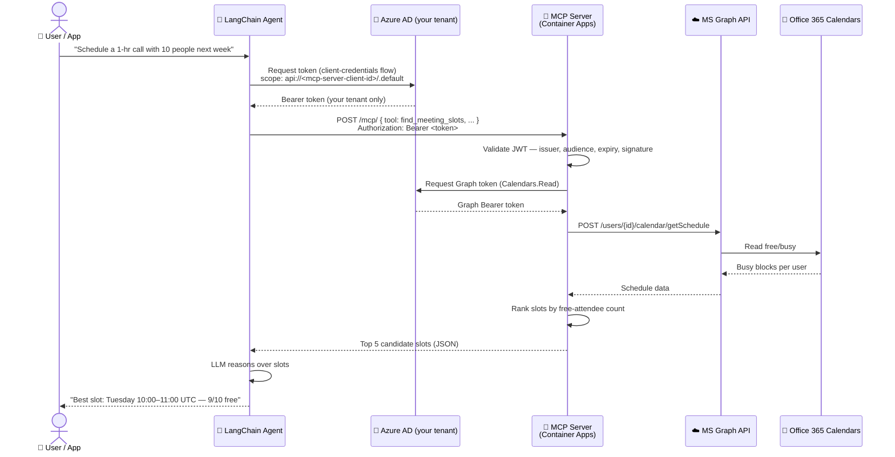
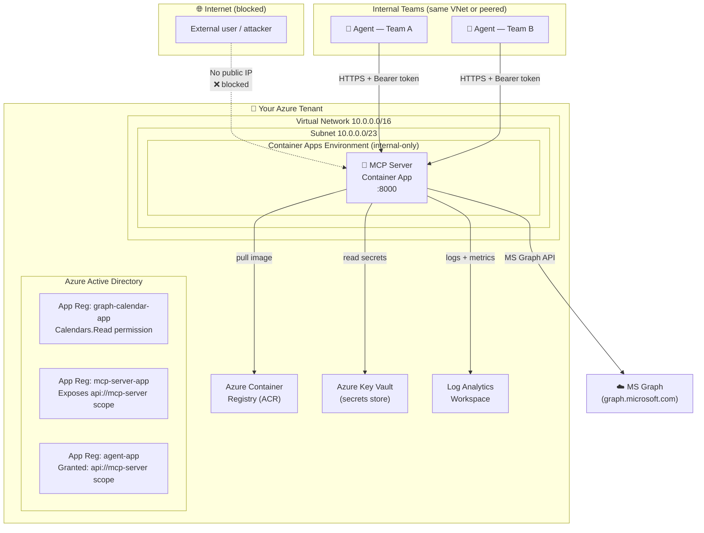
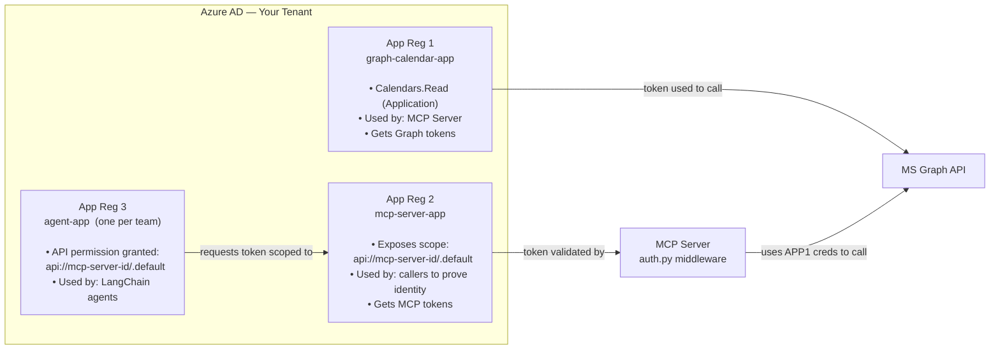
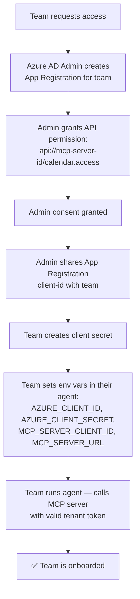
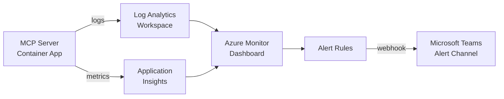

# Calendar MCP Server — Organisation Onboarding & Deployment Plan

> **Audience:** Platform engineers, Azure admins, and teams that want to use the scheduler agent.
> **Goal:** Stand up the Calendar MCP server in your Azure tenant so any internal team or AI agent can use it — and nobody outside your organisation can.

---

## Table of Contents

1. [Architecture Overview](#1-architecture-overview)
2. [Prerequisites Checklist](#2-prerequisites-checklist)
3. [Phase 1 — Azure AD Setup](#3-phase-1--azure-ad-setup)
4. [Phase 2 — Local Development & Testing](#4-phase-2--local-development--testing)
5. [Phase 3 — Container Build & Registry](#5-phase-3--container-build--registry)
6. [Phase 4 — Production Deployment to Azure](#6-phase-4--production-deployment-to-azure)
7. [Phase 5 — Onboarding a New Team / Agent](#7-phase-5--onboarding-a-new-team--agent)
8. [Phase 6 — CI/CD Pipeline](#8-phase-6--cicd-pipeline)
9. [Phase 7 — Monitoring & Alerting](#9-phase-7--monitoring--alerting)
10. [Security Controls Summary](#10-security-controls-summary)
11. [Runbook — Day-2 Operations](#11-runbook--day-2-operations)

---

## 1. Architecture Overview

### 1.1 End-to-End Request Flow



---

### 1.2 Infrastructure Topology



---

### 1.3 Two App Registrations Explained



---

## 2. Prerequisites Checklist

| # | Item | Who | Done? |
|---|------|-----|-------|
| 1 | Azure subscription with Owner or Contributor role | Azure Admin | ☐ |
| 2 | Azure AD Global Admin or Application Admin role (to create App Registrations & grant admin consent) | Azure AD Admin | ☐ |
| 3 | Office 365 licences for all users whose calendars will be read | IT Admin | ☐ |
| 4 | Azure CLI installed (`az --version` ≥ 2.55) | Platform Engineer | ☐ |
| 5 | Docker Desktop installed and running | Platform Engineer | ☐ |
| 6 | Python 3.11+ installed locally | Developer | ☐ |
| 7 | Git repository access to this codebase | Developer | ☐ |
| 8 | OpenAI API key **or** Azure OpenAI deployment | Developer / AI Lead | ☐ |

---

## 3. Phase 1 — Azure AD Setup

> **Time estimate:** 30–60 minutes (one-time, done by Azure AD Admin)

### Step 1.1 — Create the Graph API App Registration

This app is used by the **MCP server** to call Microsoft Graph and read calendars.

1. Go to **Azure Portal → Azure Active Directory → App registrations → New registration**
2. **Name:** `graph-calendar-app`
3. **Supported account types:** `Accounts in this organizational directory only (Single tenant)`
4. Click **Register**
5. Note down: **Application (client) ID** → this is `AZURE_CLIENT_ID`
6. Note down: **Directory (tenant) ID** → this is `AZURE_TENANT_ID`
7. Go to **Certificates & secrets → New client secret**
   - Description: `mcp-server-secret`
   - Expires: 24 months (rotate before expiry — see Runbook)
   - Copy the **Value** immediately → this is `AZURE_CLIENT_SECRET`
8. Go to **API permissions → Add a permission → Microsoft Graph → Application permissions**
   - Search for and add: `Calendars.Read`
9. Click **Grant admin consent for [your org]** → Confirm

### Step 1.2 — Create the MCP Server App Registration

This app defines the **protected resource** (the MCP server). Callers prove they are in your tenant by requesting a token scoped to this app.

1. **New registration** → Name: `mcp-server-app`
2. **Single tenant** → Register
3. Note down: **Application (client) ID** → this is `MCP_SERVER_CLIENT_ID`
4. Go to **Expose an API**
   - Click **Set** next to Application ID URI → accept the default `api://<client-id>` → Save
   - Click **Add a scope**:
     - Scope name: `calendar.access`
     - Who can consent: `Admins only`
     - Admin consent display name: `Access Calendar MCP Server`
     - Admin consent description: `Allows the application to call the Calendar MCP Server`
     - State: **Enabled**

### Step 1.3 — Create an Agent App Registration (one per team / agent)

Each team or AI agent that will call the MCP server needs its own identity.

1. **New registration** → Name: `agent-team-a` (or `agent-<teamname>`)
2. **Single tenant** → Register
3. Go to **Certificates & secrets** → create a client secret → save value
4. Go to **API permissions → Add a permission → My APIs → mcp-server-app**
   - Select: `calendar.access`
   - Type: Application
5. Click **Grant admin consent** → Confirm

> Repeat Step 1.3 for every team that needs access. Revoke a team's access instantly by removing their API permission or disabling their App Registration — no code changes needed.

---

## 4. Phase 2 — Local Development & Testing

> **Time estimate:** 15 minutes per developer

### Step 2.1 — Clone and install

```powershell
# Clone the repo
git clone <your-repo-url>
cd mcp

# Create and activate a virtual environment
python -m venv .venv
.venv\Scripts\Activate.ps1

# Install all dependencies
pip install -r requirements.txt
```

### Step 2.2 — Configure environment

```powershell
# Copy the template
Copy-Item .env.example .env
```

Edit `.env` — for **local dev** you only need:

```ini
# Azure AD (for MS Graph calendar reads)
AZURE_TENANT_ID=<your-tenant-id>
AZURE_CLIENT_ID=<graph-calendar-app client-id>
AZURE_CLIENT_SECRET=<secret>

# LLM
OPENAI_API_KEY=sk-...

# Leave MCP_SERVER_URL blank for local stdio mode
# MCP_SERVER_URL=
```

### Step 2.3 — Run locally

```powershell
# Run the scheduling agent in local (stdio) mode
python main.py

# Or with a custom prompt
python main.py "Schedule a 45-min retrospective for alice@contoso.com and bob@contoso.com next Tuesday to Thursday"
```

Expected output:
```
======================================================================
Calendar Scheduling Agent
======================================================================
Request: Schedule a 45-min retrospective ...
----------------------------------------------------------------------
Agent recommendation:
Best slot: Tuesday 09:00–09:45 UTC
9 of 10 attendees are free. Bob has a conflict (existing meeting 09:00–10:00).
Alternative: Tuesday 10:00–10:45 UTC — all 10 attendees are free.
======================================================================
```

### Step 2.4 — Run MCP server standalone (for debugging tools)

```powershell
# Start MCP server in HTTP mode locally
$env:MCP_TRANSPORT = "http"
$env:AZURE_TENANT_ID = "<tenant-id>"
$env:AZURE_CLIENT_ID = "<client-id>"
$env:AZURE_CLIENT_SECRET = "<secret>"
$env:MCP_SERVER_CLIENT_ID = "<mcp-server-client-id>"

python -m mcp_server.server

# In another terminal — test health endpoint
Invoke-RestMethod http://localhost:8000/health
# Expected: { "status": "ok" }
```

---

## 5. Phase 3 — Container Build & Registry

> **Time estimate:** 10 minutes

### Step 3.1 — Login to Azure and ACR

```powershell
az login
az acr login --name acrmcpcalendar
```

### Step 3.2 — Build and verify locally

```powershell
# Build the image
docker build -t mcp-calendar:local .

# Run locally with Docker to verify it starts
docker run --rm -p 8000:8000 `
  -e MCP_TRANSPORT=http `
  -e AZURE_TENANT_ID=<tenant-id> `
  -e AZURE_CLIENT_ID=<client-id> `
  -e AZURE_CLIENT_SECRET=<secret> `
  -e MCP_SERVER_CLIENT_ID=<mcp-server-client-id> `
  mcp-calendar:local

# Test health from another terminal
Invoke-RestMethod http://localhost:8000/health
```

### Step 3.3 — Push to ACR

```powershell
# Tag and push
$ACR = "acrmcpcalendar.azurecr.io"
docker tag mcp-calendar:local $ACR/mcp-calendar:v1.0.0
docker push $ACR/mcp-calendar:v1.0.0
```

> In CI/CD this step is automated — see Phase 6.

---

## 6. Phase 4 — Production Deployment to Azure

> **Time estimate:** 20–30 minutes (one-time, done by Platform Engineer)

### Step 4.1 — Set environment variables

```powershell
$env:AZURE_TENANT_ID        = "<your-tenant-id>"
$env:AZURE_CLIENT_ID        = "<graph-calendar-app client-id>"
$env:AZURE_CLIENT_SECRET    = "<secret>"
$env:MCP_SERVER_CLIENT_ID   = "<mcp-server-app client-id>"
```

### Step 4.2 — Run the deployment script

```powershell
# From the repo root
.\deploy.ps1
```

The script will:
1. Create Resource Group `rg-mcp-calendar`
2. Create Azure Container Registry and build the image via `az acr build`
3. Create a VNet with a private subnet
4. Create an Azure Key Vault and store all secrets there
5. Create a Container Apps Environment with **`--internal-only true`** (no public IP)
6. Deploy the Container App with internal ingress only
7. Print the internal FQDN

### Step 4.3 — Verify deployment

```powershell
# Get the internal FQDN
$FQDN = az containerapp show `
  --name ca-mcp-calendar `
  --resource-group rg-mcp-calendar `
  --query properties.configuration.ingress.fqdn -o tsv

# From a machine inside the VNet or via VPN:
Invoke-RestMethod "https://$FQDN/health"
# Expected: { "status": "ok" }
```

### Step 4.4 — Configure agent to use the deployed server

Add to `.env`:

```ini
MCP_SERVER_URL=https://<internal-fqdn>/mcp/
MCP_SERVER_CLIENT_ID=<mcp-server-app client-id>
AZURE_CLIENT_ID=<agent-app client-id>
AZURE_CLIENT_SECRET=<agent-app secret>
```

Run the agent — it will now call the deployed server over HTTPS with Azure AD authentication.

---

## 7. Phase 5 — Onboarding a New Team / Agent

> **Time estimate:** 10 minutes per team (done by Azure AD Admin)



**Checklist for onboarding a new team:**

| Step | Action | Who |
|------|--------|-----|
| 1 | Create App Registration for the team | Azure AD Admin |
| 2 | Grant `api://mcp-server-id/calendar.access` permission | Azure AD Admin |
| 3 | Grant admin consent | Azure AD Admin |
| 4 | Share App Registration Client ID with team | Azure AD Admin |
| 5 | Team creates a client secret in their App Registration | Team |
| 6 | Team adds env vars to their agent config | Team |
| 7 | Team tests with `python main.py` | Team |
| 8 | Team confirms working and notifies platform team | Team |

**To revoke a team's access:**

```powershell
# Option A — Remove the API permission (soft revoke — existing tokens still valid until expiry)
# In Azure Portal → team's App Registration → API permissions → remove calendar.access

# Option B — Disable the App Registration entirely (hard revoke — immediate)
az ad app update --id <team-app-client-id> --sign-in-audience none
```

---

## 8. Phase 6 — CI/CD Pipeline

> The pipeline runs on every push to `main` and on pull requests.

```mermaid
flowchart LR
    subgraph PR["Pull Request"]
        PR1[Lint: ruff] --> PR2[Type check: mypy]
        PR2 --> PR3[Unit tests: pytest]
        PR3 --> PR4[Docker build\n(no push)]
    end

    subgraph Merge["Merge to main"]
        M1[Build Docker image] --> M2[Push to ACR with\ngit SHA tag]
        M2 --> M3[Deploy to STAGING\nContainer App]
        M3 --> M4[Integration smoke test:\nGET /health]
        M4 --> M5{Tests pass?}
        M5 -->|Yes| M6[Promote to PRODUCTION\nContainer App]
        M5 -->|No| M7[Rollback — revert to\nprevious revision]
    end

    PR --> Merge
```

**GitHub Actions workflow** (`.github/workflows/deploy.yml`):

```yaml
name: Build and Deploy MCP Server

on:
  push:
    branches: [main]
  pull_request:
    branches: [main]

env:
  ACR_NAME: acrmcpcalendar
  APP_NAME: ca-mcp-calendar
  RESOURCE_GROUP: rg-mcp-calendar

jobs:
  test:
    runs-on: ubuntu-latest
    steps:
      - uses: actions/checkout@v4
      - uses: actions/setup-python@v5
        with: { python-version: "3.12" }
      - run: pip install -r requirements.txt ruff mypy pytest
      - run: ruff check .
      - run: pytest tests/ -v

  build-and-deploy:
    needs: test
    runs-on: ubuntu-latest
    if: github.ref == 'refs/heads/main'
    permissions:
      id-token: write   # for OIDC login to Azure — no stored secrets
      contents: read

    steps:
      - uses: actions/checkout@v4

      - name: Login to Azure (OIDC — no stored credentials)
        uses: azure/login@v2
        with:
          client-id: ${{ secrets.AZURE_CLIENT_ID }}
          tenant-id: ${{ secrets.AZURE_TENANT_ID }}
          subscription-id: ${{ secrets.AZURE_SUBSCRIPTION_ID }}

      - name: Build and push image to ACR
        run: |
          az acr build \
            --registry $ACR_NAME \
            --image mcp-calendar:${{ github.sha }} \
            --image mcp-calendar:latest \
            --file Dockerfile .

      - name: Deploy to Container Apps
        run: |
          az containerapp update \
            --name $APP_NAME \
            --resource-group $RESOURCE_GROUP \
            --image $ACR_NAME.azurecr.io/mcp-calendar:${{ github.sha }}

      - name: Smoke test
        run: |
          FQDN=$(az containerapp show \
            --name $APP_NAME \
            --resource-group $RESOURCE_GROUP \
            --query properties.configuration.ingress.fqdn -o tsv)
          curl -f https://$FQDN/health
```

> **Security note:** The pipeline uses Azure OIDC (Federated Identity) — no client secrets stored in GitHub. Configure this in Azure AD → App Registration → Federated credentials.

---

## 9. Phase 7 — Monitoring & Alerting

### Step 9.1 — Enable structured logging

The MCP server logs every request including the caller's `oid` (object ID from the JWT claims) so you can audit who called what and when.

Log Analytics query to see all tool calls:

```kusto
ContainerAppConsoleLogs_CL
| where ContainerName_s == "ca-mcp-calendar"
| where Log_s contains "tool_call"
| project TimeGenerated, caller_oid=extract('"oid":"([^"]+)"', 1, Log_s),
          tool=extract('"tool":"([^"]+)"', 1, Log_s)
| order by TimeGenerated desc
```

### Step 9.2 — Alerts to configure

| Alert | Condition | Severity | Action |
|-------|-----------|----------|--------|
| Server down | Health probe fails 3× in 5 min | Critical | PagerDuty / Teams |
| Auth failures spike | 401 responses > 10/min | High | Teams notification |
| High latency | P95 response time > 10s | Medium | Email |
| Client secret expiry | Secret expires in 30 days | High | Email to admin |

### Step 9.3 — Dashboard



---

## 10. Security Controls Summary

| Control | Where enforced | What it prevents |
|---------|---------------|-----------------|
| **No public IP** | Azure Container Apps `--internal-only` flag | Internet access entirely blocked |
| **Azure AD JWT validation** | `mcp_server/auth.py` middleware | Unauthenticated & cross-tenant requests |
| **Single-tenant App Registration** | Azure AD | Tokens from other tenants rejected |
| **Per-team App Registrations** | Azure AD | Blast radius isolation; easy revocation |
| **Admin consent required** | Azure AD API permission | No team can self-grant access |
| **Secrets in Key Vault** | `deploy.ps1` | No secrets in code, env vars, or ACR image |
| **Non-root container** | `Dockerfile` | Container escape privileges limited |
| **OIDC in CI/CD** | GitHub Actions | No long-lived secrets stored in CI |
| **Client-credentials flow only** | `graph_client.py`, `auth.py` | No user impersonation; app-level control |
| **Token expiry enforced** | `python-jose` in `auth.py` | Stolen tokens cannot be replayed |

---

## 11. Runbook — Day-2 Operations

### Rotate a client secret (every 24 months or on suspicion of leak)

```powershell
# 1. In Azure Portal → App Registration → Certificates & secrets
#    → add NEW secret → note down value

# 2. Update Key Vault
az keyvault secret set --vault-name kv-mcp-calendar --name AzureClientSecret --value <new-secret>

# 3. Restart Container App to pick up new secret
az containerapp revision restart `
  --name ca-mcp-calendar `
  --resource-group rg-mcp-calendar `
  --revision-name (az containerapp revision list `
      --name ca-mcp-calendar `
      --resource-group rg-mcp-calendar `
      --query "[0].name" -o tsv)

# 4. Delete the old secret from the App Registration
```

### Scale the server

```powershell
az containerapp update `
  --name ca-mcp-calendar `
  --resource-group rg-mcp-calendar `
  --min-replicas 2 `
  --max-replicas 10
```

### Roll back to a previous version

```powershell
# List revisions
az containerapp revision list `
  --name ca-mcp-calendar `
  --resource-group rg-mcp-calendar `
  --output table

# Activate a previous revision
az containerapp revision activate `
  --name ca-mcp-calendar `
  --resource-group rg-mcp-calendar `
  --revision-name <previous-revision-name>
```

### Add a new calendar user to the allowed list

No code change needed. The `Calendars.Read` application permission already allows the MCP server to read any mailbox in your tenant. Simply pass the new user's email in the `attendee_emails` list when calling the agent.

---

*End of Onboarding Plan*
